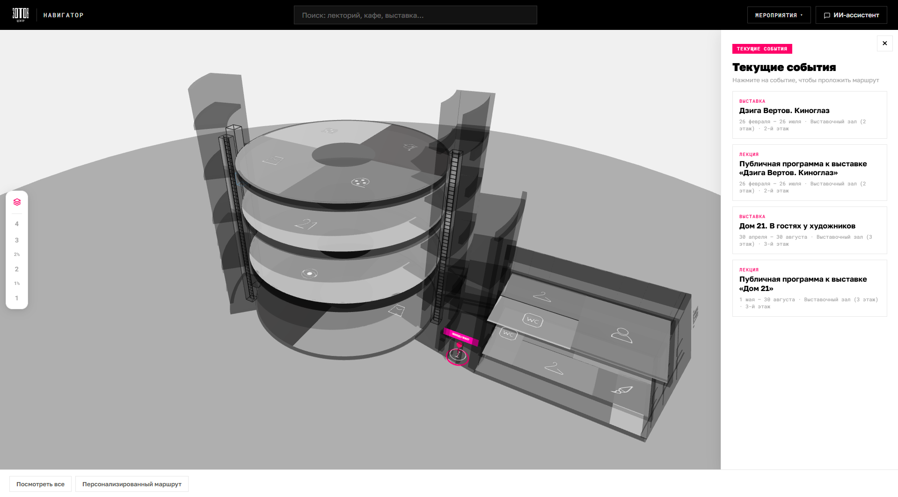
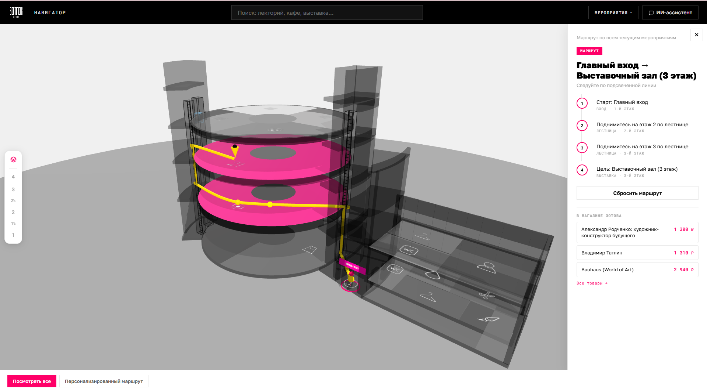
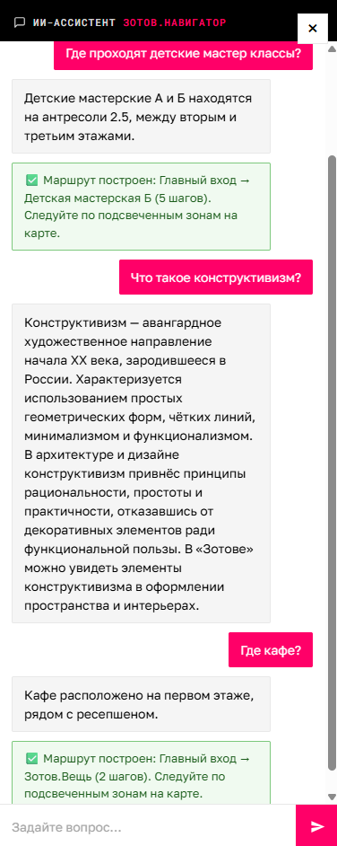

# Зотов.Навигатор 🧭

> Веб-приложение с интерактивной **3D-картой** и **ИИ-ассистентом** для digital-навигации по культурному центру «Зотов» (бывший Хлебозавод №5) — памятнику конструктивизма круглой формы.

🥇 1 место · в кейсе от «Зотов.Центр»

🏆 3 место · в общем зачете хакатона «Креаторы и Кодеры» · Universal University × Школа 21


---

## Проблема

Из-за круглой планировки, кольцевых галерей и многофункциональности здания посетители «Зотова» легко теряются: сложные маршруты, высокая нагрузка на ресепшн, отсутствие единой карты пространства. Задача хакатона — сделать рабочий прототип цифровой навигации, которая упрощает ориентирование и снижает фрустрацию.

## Решение

«Зотов.Навигатор» — это **навигация от события, а не от места**: посетитель выбирает мероприятие или пространство (или просто спрашивает у ИИ-ассистента), а система строит маршрут по интерактивной 3D-модели здания. Модель повторяет реальную круглую планировку — каждый этаж это цилиндр, а зоны описаны секторами кольца, что точно отражает архитектуру бывшего конвейерного хлебозавода.

## 📸 Скриншоты

| Общий вид | Построенный маршрут | ИИ-ассистент |
|---|---|---|
|  |  |  |

## Возможности

- **Интерактивная 3D-карта** здания на Three.js — вращение, зум, переключение этажей.
- **ИИ-ассистент** — отвечает на вопросы посетителя в свободной форме и строит маршруты по запросу («как пройти в лекторий?», «что посмотреть сегодня?»).
- **Построение маршрута** от точки до точки с пошаговыми инструкциями и оценкой времени.
- **Персонализированный маршрут дня** — оптимальный путь через несколько выбранных мероприятий.
- **Глобальный поиск** по зонам и событиям.
- **Афиша** — список ближайших мероприятий с переходом к маршруту.
- **Сценарий «Всё посмотреть»** — обзорный маршрут по ключевым пространствам центра.
- **Стилистика конструктивизма** — минимализм, геометрия, палитра чёрный/белый/красный.

## Стек

| Слой | Технологии |
|---|---|
| **Backend** | Java 17, Spring Boot 3.4, Spring Web (REST), Spring Data JPA, Validation |
| **База данных** | H2 (in-memory для хакатона) с возможностью переключения на PostgreSQL |
| **Frontend** | Vanilla JS (ES modules), Three.js для 3D, чистый CSS |
| **Документация API** | springdoc-openapi (Swagger UI) |
| **Интеграции** | jsoup — парсинг афиши с сайта centrezotov.ru |
| **Сборка** | Maven |

## Архитектура

Классическая слоистая архитектура Spring Boot. DTO отделены от JPA-сущностей, ошибки обрабатываются глобально через `@RestControllerAdvice`.

```
Браузер (Three.js 3D-сцена + UI + ИИ-ассистент + fetch-клиент)
        │  HTTP / JSON
        ▼
Spring Boot Backend
  controller/  REST-контроллеры (/api/...)
  service/     бизнес-логика, построение маршрутов (граф + Dijkstra)
  repository/  Spring Data JPA
  model/       Floor, Zone, Event
        ▼
   H2 / PostgreSQL
```

Здание моделируется как 5 цилиндров-этажей; зоны — секторы кольца (`angleStart`/`angleEnd`, `radiusInner`/`radiusOuter`), что естественно ложится на `RingGeometry` в Three.js. Граф навигации строится в памяти при старте: соседние сектора этажа соединены, этажи связаны через лестницы и лифт; кратчайший путь ищется алгоритмом **Dijkstra**.

## REST API

Базовый префикс `/api`, ответы — JSON. Полная спецификация — в Swagger UI после запуска.

| Метод | Путь | Описание |
|---|---|---|
| GET | `/api/floors` | Список этажей |
| GET | `/api/floors/{id}` | Этаж с зонами |
| GET | `/api/zones` | Зоны (фильтры `?type=CAFE&floorId=2`) |
| GET | `/api/events/upcoming` | Ближайшие события |
| POST | `/api/route` | Построить маршрут между двумя зонами |
| POST | `/api/route/multi` | Маршрут по нескольким точкам (план дня) |
| GET | `/api/search?q=...` | Поиск по зонам и событиям |

## Быстрый старт

Требуется JDK 17+.

```bash
git clone [https://github.com/sonyachibisova/ZotovNavigation.git](https://github.com/sonyachibisova/Zotov-Navigator.git)
cd ZotovNavigator
./mvnw spring-boot:run        # Windows: mvnw.cmd spring-boot:run
```

После старта:

- Приложение — http://localhost:8080
- Swagger UI — http://localhost:8080/swagger-ui.html
- H2-консоль — http://localhost:8080/h2-console (JDBC URL: `jdbc:h2:mem:zotov`)

Тестовые данные (этажи, зоны, события) загружаются автоматически из `data.sql` при старте.

## Структура проекта

```
src/main/java/ru/zotov/navigator/
├── config/       CORS, OpenAPI
├── controller/   REST-контроллеры
├── service/      бизнес-логика, построение маршрутов
├── repository/   Spring Data JPA
├── model/        Floor, Zone, Event
├── dto/          DTO запросов/ответов
└── exception/    глобальная обработка ошибок
src/main/resources/static/   frontend (Three.js, CSS, JS)
docs/                        техдокументация и кейс
```

## Моя роль
Чибисова Софья — Full-stack разработка: доменная модель, REST API для карты, маршрутов и афиши, серверная логика построения маршрутов, интеграция парсинга событий (Backend на Java, Spring Boot, Maven); клиентская часть приложения (Frontend); настройка серверов и деплой проекта

## Документация

В папке [`docs/`](docs/) — полная техническая спецификация, описание архитектуры интеграции и исходный кейс от Центра «Зотов».

## 🏆 Награды

🥇 1 место · в кейсе от «Зотов.Центр»

🥉 3 место в общем зачете на хакатоне «Креаторы и Кодеры» (Universal University × Школа 21).

📄 [Диплом и материалы проекта (Google Drive)](https://drive.google.com/drive/folders/1fT5_ewns_3JcHY44i1cD6fKj_FqIDaQf?usp=sharing)
